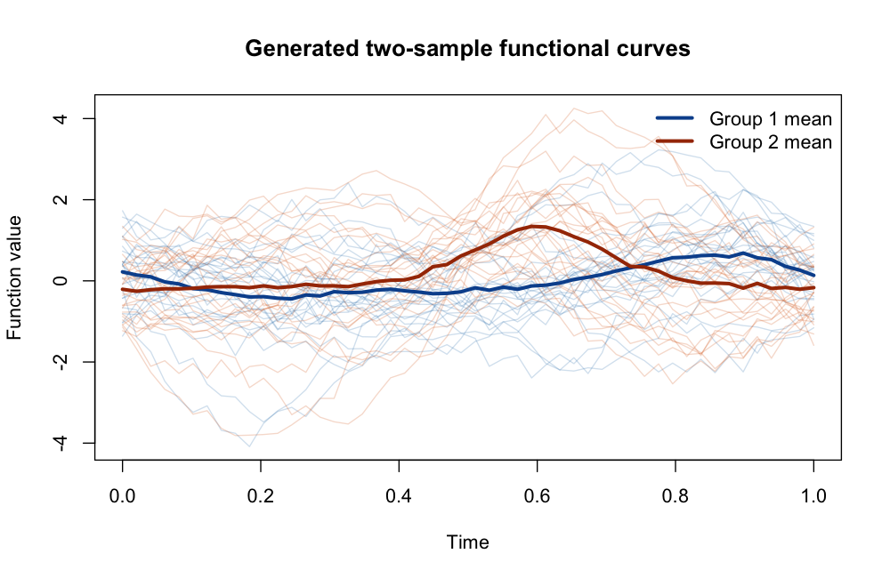

# Functional Two-Sample Test based on Projection

Welcome! This repository is the code companion for our paper **"Functional
Two-Sample Test based on Projection"**, by Yang Bai, Caihong Qin, and Huichen
Zhu. The paper was published in *Statistica Sinica*, with DOI:
https://doi.org/10.5705/ss.202023.0272.

The paper studies how to test whether two groups of functional observations
have the same mean function. The main idea is to project curves onto informative
low-dimensional spaces and then apply a Hotelling-type test to the projected
data. The code here provides functions to implement our proposed projection
tests.

## Example

The example below shows how to implement the functional two-sample test using
projection functions based on B-spline functions. The simulated example uses
`n1 = n2 = 25` curves observed on a grid of length `50`.

```r
# Install the required packages if they are not already available.
install.packages(c("MASS", "fda"))

# Load the functions for simulation, plotting, projection, and testing.
source("functional_projection_tests.R")

# Generate two groups of functional observations.
example_data <- simulate_functional_two_sample_data(
  n1 = 25,                         # sample size in group 1
  n2 = 25,                         # sample size in group 2
  grid = seq(0, 1, length.out = 50), # observation grid
  signal_strength = 0.55,          # size of the mean difference
  noise_sd = 0.30,                 # noise level in the generated curves
  seed = 2026                      # random seed for reproducibility
)

# Save a figure showing the generated curves and their sample means.
plot_functional_two_sample_data(
  data = example_data,                    # generated two-sample functional data
  file = "generated_functional_curves.png" # output figure file
)

# Apply the projection-based two-sample test using cubic B-spline functions.
bspline_fit <- functional_two_sample_test(
  x = example_data$x,       # group 1 curves; rows are curves, columns are grid points
  y = example_data$y,       # group 2 curves; rows are curves, columns are grid points
  grid = example_data$grid, # observation grid
  method = "bspline",       # use B-spline projection functions
  d = 6                     # number of B-spline basis functions
)

bspline_fit$p.value
bspline_fit$projected_dimension
```

Here, `simulate_functional_two_sample_data()` generates two sample groups of
curves, `plot_functional_two_sample_data()` saves a figure of the generated
curves, and `functional_two_sample_test()` returns the testing result after
projection. To use your own data, replace `example_data$x` and `example_data$y`
with two matrices of curves, where each row is one curve and each column is one
observed time point.

The code above saves the following figure of the generated two-sample functional
curves:



## Details

The repository includes:

- `functional_projection_tests.R`: functions for data generation, plotting,
  projection construction, and projected Hotelling-type testing.
- `generated_functional_curves.png`: a figure generated from the example data.

Required R packages:

- `MASS`: used for the Moore-Penrose generalized inverse in Hotelling's test.
- `fda`: used to construct and evaluate B-spline basis functions.
- The code also uses standard R packages, including `stats`, `graphics`, and
  `grDevices`.

In the code, we provide functional two-sample tests based on the following
projection choices:

- `bspline`: uses cubic B-spline basis functions as projection functions. The
  default number of basis functions is `d = 6`.
- `cg`: uses repeated sample splitting and the conjugate-gradient projection
  statistic, with default dimension `d = 5`.
- `fpca_q`: uses functional principal component directions from the overall
  covariance and ranks them by extracted mean-difference information.
- `fpca_lambda`: uses functional principal component directions from the overall
  covariance and ranks them by eigenvalue size.

Each method can be run by changing the `method` argument in
`functional_two_sample_test()`. For example:

```r
fpca_fit <- functional_two_sample_test(
  x = example_data$x,       # group 1 curves
  y = example_data$y,       # group 2 curves
  grid = example_data$grid, # observation grid
  method = "fpca_q"         # rank FPCA directions by extracted mean-difference information
)

fpca_fit$p.value
```
